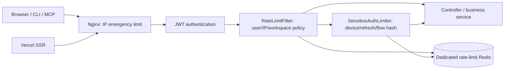

# [PLAN] 레이트리미트 적용 범위 및 단계별 도입

## 0. 메타
- ID: PLAN-2026-07-14-rate-limit-scope
- 작성일: 2026-07-14
- 작성자: OpenLog
- 상태: Ready
- 관련 링크: [워크스페이스 API 호출 감소 전후 비교](../tasks/2026-07-14_reduce-workspace-api-calls.md)
- 영향 범위: `deploy/production/nginx`, `backend` Security Filter Chain, Redis, Web/CLI/MCP API 클라이언트, 운영 모니터링

## 1. 배경/문제 (Background / Problem)

### 현재 상태

- 외부 API는 `api.openlog.kr`의 Nginx를 거쳐 Spring Boot `/api/**`로 전달된다.
- Nginx에는 TLS, 10MB body 제한, proxy header 설정만 있고 요청 속도 제한은 없다.
- Spring Security는 인증·인가만 처리하며 요청 빈도나 비용을 제한하지 않는다.
- Web과 CLI는 같은 access token cookie 이름을 사용하고 JWT에는 user ID만 있어 Web/CLI/MCP를 구분할 수 없다.
- CLI device login은 2초 간격, 즉 정상 흐름에서도 device code당 약 30회/분 polling한다.
- Redis는 이미 device login 상태 등에 사용되지만 운영 설정이 `allkeys-lru`이고 인증 상태와 같은 인스턴스를 공유한다.
- 프론트 서버 렌더 요청은 Vercel 서버에서 백엔드로 전송될 수 있으므로 Nginx가 보는 원격 IP가 최종 사용자가 아니라 Vercel 공용 출구 IP일 수 있다.

### 문제점

- 공개·인증 API 모두 무제한 호출할 수 있어 brute force, polling 오작동, 봇, 토큰 탈취 후 자동화, 클라이언트 버그에 취약하다.
- Nginx IP 제한만 낮게 적용하면 같은 Vercel 출구 IP를 공유하는 정상 사용자가 함께 차단될 수 있다.
- 애플리케이션 메모리 제한만 적용하면 재시작 때 상태가 초기화되고 백엔드 다중 인스턴스에서 한도가 분산된다.
- 현재 `JwtAuthenticationFilter`가 인증 요청마다 User DB를 조회하므로 애플리케이션 필터만으로는 인증 이전 자원 소모를 막지 못한다.
- CLI는 429와 `Retry-After`를 처리하지 않아 device polling 중 한 번만 제한돼도 로그인이 즉시 실패한다.
- 기존 Redis에 고카디널리티 rate-limit key를 추가하면 인증용 key가 메모리 압박으로 퇴출될 수 있다.

### 해결 필요성

- 네트워크 경계에서는 비정상 단일 출처의 폭주를 빠르게 차단해야 한다.
- 애플리케이션에서는 user, workspace, device code, refresh session처럼 제품 의미를 아는 주체별로 공정한 한도를 적용해야 한다.
- 제한값은 정상 SSR·CLI·MCP burst를 수용하면서 오작동과 남용을 차단할 수 있어야 한다.
- 차단 전 관측 모드와 단계별 rollout이 필요하다.

## 2. 목표/비목표 (Goals / Non-goals)

### Goals

- Nginx와 Spring 애플리케이션의 2계층 레이트리미트를 설계한다.
- 인증 상태와 endpoint 비용을 기준으로 정책 그룹을 정의한다.
- Web SSR의 공용 출구 IP와 CLI device polling을 정상 트래픽으로 고려한다.
- 다중 인스턴스에서도 동일하게 동작하는 Redis 기반 원자적 token bucket을 사용한다.
- 429 응답 계약, 클라이언트 처리, 관측 지표, 장애 시 동작을 정의한다.
- 관측 모드에서 시작해 인증·고비용·쓰기·읽기 순서로 안전하게 적용한다.

### Non-goals

- CDN/WAF 도입이나 대규모 DDoS 흡수 자체를 이번 설계로 해결하지 않는다.
- 사용자별 유료 플랜 quota 또는 일/월 사용량 과금을 구현하지 않는다.
- API payload, DB query, cache 정책 최적화를 레이트리미트로 대체하지 않는다.
- 동시 실행 수, 요청 timeout, circuit breaker, queue backpressure는 별도 보호 장치로 남긴다.
- 이번 Plan에서는 구현 코드를 변경하지 않는다.

## 3. 사용자 흐름 (User Flow)

### 정상 Web 사용자

- 진입점: 사용자가 페이지를 열거나 mutation을 실행한다.
- 주요 단계:
  1. Nginx가 원격 IP 기준 비상 상한을 확인한다.
  2. JWT 인증 후 애플리케이션이 user ID와 route policy를 결정한다.
  3. Redis token bucket에 여유가 있으면 요청을 처리하고 남은 한도를 응답 header에 담는다.
- 완료 상태: 일반 페이지 렌더와 사용자의 짧은 연속 조작은 burst 범위에서 제한되지 않는다.

### CLI/MCP 사용자

- 진입점: CLI login, CLI 명령 또는 MCP tool이 API를 호출한다.
- 주요 단계:
  1. device start는 IP, device token polling은 device code hash와 IP로 제한한다.
  2. 로그인 후 API는 Web과 동일한 user ID 한도를 사용한다.
  3. 429를 받으면 CLI는 `Retry-After`만큼 기다린 뒤 안전한 요청만 재시도한다.
- 완료 상태: 정상 2초 polling과 에이전트의 짧은 read burst는 성공하고, 무한 polling과 과도한 자동화는 지연 또는 차단된다.

### 제한된 요청

- 진입점: 정책 bucket에 필요한 token이 없는 요청이 들어온다.
- 주요 단계:
  1. 비즈니스 로직과 외부 저장소 호출 전에 요청을 중단한다.
  2. HTTP 429, JSON error, `Retry-After`를 반환한다.
  3. 정책명과 결과를 metric에 기록하되 user ID, token, IP 원문은 metric label에 넣지 않는다.
- 완료 상태: 클라이언트가 재시도 가능 시점을 알 수 있고 운영자는 어떤 정책이 제한했는지 확인할 수 있다.

## 4. 아키텍처 방향 (Architecture)

### 4.1 선택한 방향

- 계층 1: Nginx의 IP 기반 고한도 비상 차단
- 계층 2: Spring의 Redis 기반 주체·route 정책 제한
- 알고리즘: burst를 허용하는 token bucket
- 저장소: 운영에서는 인증 Redis와 분리한 rate-limit 전용 Redis
- rollout: `disabled → observe → enforce` 모드



Nginx의 IP 상한은 Vercel SSR이 공용 IP를 사용할 수 있으므로 애플리케이션의 실제 사용자 quota로 사용하지 않는다. 단일 출처가 초당 수백 요청을 보내는 비정상 상황을 백엔드 진입 전에 자르는 안전망으로만 사용한다.

### 4.2 주요 컴포넌트

#### Nginx emergency limiter

- `$binary_remote_addr` 기준 shared memory zone을 사용한다.
- 전체 `/api/**`에 높은 상한을 적용한다.
- device start와 OAuth start처럼 최종 사용자 IP가 직접 도달하는 endpoint만 별도 zone을 검토한다.
- `limit_req_status 429`를 사용하고 429 응답을 JSON 계약으로 변환한다.
- 현재 `$proxy_add_x_forwarded_for`는 외부에서 전달한 X-Forwarded-For가 섞일 수 있으므로 직접 edge 운영 시 `X-Forwarded-For $remote_addr`로 덮어쓴다.
- 향후 CDN을 앞에 둘 때만 허용된 proxy CIDR에 `set_real_ip_from`을 적용한다. 임의 요청 header를 client IP로 신뢰하지 않는다.

#### RateLimitFilter

- `JwtAuthenticationFilter` 다음, Controller/Service 실행 전에 배치한다.
- HTTP method와 정규화된 route template으로 policy를 선택한다.
- 인증 요청은 user ID, workspace route는 필요 시 workspace ID를 조합한다.
- OPTIONS와 운영 health check는 제외한다.
- raw path의 resource ID를 metric label로 사용하지 않는다.

#### SensitiveAuthLimiter

- request body나 cookie의 device code, refresh token, OAuth flow ID가 필요한 정책을 담당한다.
- generic Servlet filter에서 body를 임의로 소비하지 않고 Controller 경계에서 DTO가 역직렬화된 직후, DB 또는 token 발급 전에 실행한다.
- 원문 secret은 저장하거나 기록하지 않고 server-side pepper를 사용한 HMAC-SHA-256 값만 subject key로 사용한다.

#### RedisTokenBucketStore

- Redis Lua script로 refill, 다중 bucket 확인, token 차감을 원자적으로 처리한다.
- 한 요청에 global user bucket과 route bucket이 함께 적용될 때 모든 bucket이 허용되는 경우에만 차감한다.
- key 형식: `ratelimit:v1:{policy}:{subjectHash}`
- TTL은 bucket이 완전히 refill되는 시간보다 충분히 길게 설정하고 유휴 key는 자동 삭제한다.
- Redis server time을 사용해 backend instance 간 clock 차이를 제거한다.

#### 전용 Redis

- 운영 compose에 `redis-rate-limit` 서비스를 별도로 둔다.
- rate-limit counter는 복구할 영속 데이터가 아니므로 AOF/RDB를 끄고 제한된 maxmemory와 `noeviction`을 사용한다.
- key는 TTL로 회수하며 메모리가 가득 차면 조용히 기존 counter를 지우지 않고 Redis 오류를 발생시켜 정책별 fail open/closed 규칙으로 처리한다.
- 인증 device code와 OAuth state가 있는 기존 Redis와 분리해 counter churn이 인증 상태를 퇴출하지 못하게 한다.
- 로컬 개발은 별도 container가 부담이면 기존 Redis의 별도 namespace를 사용할 수 있지만 운영과 동일한 장애 격리를 보장하지는 않는다.

### 4.3 데이터 흐름

1. Nginx가 실제 remote address 기준 emergency bucket을 확인한다.
2. 통과한 요청은 Spring Security로 전달된다.
3. JWT가 유효하면 user principal을 설정한다.
4. `RateLimitPolicyResolver`가 method + route template을 policy로 매핑한다.
5. `RateLimitSubjectResolver`가 user, workspace, IP 중 필요한 subject를 구성하고 HMAC 처리한다.
6. Redis Lua script가 적용 대상 bucket을 한 번에 평가한다.
7. 허용이면 Controller로 전달하고 제한 header를 추가한다.
8. 거부면 Controller를 실행하지 않고 429를 반환한다.

### 4.4 대안과 트레이드오프

- Nginx만 사용:
  - 장점: 가장 앞단에서 저렴하게 차단한다.
  - 단점: Vercel SSR 공용 IP, 인증 사용자, device code, workspace를 구분하지 못한다.
  - 결정: 비상 상한으로만 사용한다.
- backend in-memory limiter:
  - 장점: 구현이 단순하고 Redis latency가 없다.
  - 단점: 재시작 시 초기화되고 instance 수만큼 한도가 늘어난다.
  - 결정: 운영 정책 저장소로 사용하지 않는다.
- fixed window counter:
  - 장점: 구현이 단순하다.
  - 단점: window 경계에서 최대 두 배 burst가 발생한다.
  - 결정: 사용자 조작과 CLI polling burst를 자연스럽게 처리하는 token bucket을 사용한다.
- 기존 Redis 공유:
  - 장점: 인프라 추가가 없다.
  - 단점: 현재 `allkeys-lru`에서 rate-limit key가 인증 key를 밀어낼 수 있다.
  - 결정: 운영에서는 전용 Redis를 사용한다.
- 모든 공개 읽기를 즉시 IP 제한:
  - 장점: scraper 방어가 빠르다.
  - 단점: SSR 공용 출구 IP를 정상 사용자 IP로 오인할 수 있다.
  - 결정: 초기에는 observe만 하고 trusted frontend identity 또는 CDN 경계가 마련된 뒤 enforce한다.

## 5. 적용 범위와 초기 정책

### 5.1 정책 적용 원칙

- 정책값은 최종 SLA가 아니라 첫 observe를 위한 초기값이다.
- 한 요청은 global bucket과 route-specific bucket을 함께 적용받을 수 있다.
- 인증 사용자 제한의 기본 key는 user ID이며 User-Agent로 Web/CLI/MCP를 구분하지 않는다.
- workspace quota는 현재 개인 소유 구조에서도 hot workspace를 식별하고 향후 팀 workspace를 대비하기 위해 사용한다.
- IP bucket은 NAT, 회사망, Vercel egress 공유를 고려해 주체 bucket보다 넉넉하게 잡는다.

### 5.2 정책표

| 정책 | 대상 | Subject | 초기 refill / burst | 초기 모드 | 근거 |
|---|---|---|---|---|---|
| `EDGE_EMERGENCY` | 전체 `/api/**` | remote IP | 100 req/s, burst 200 | Enforce | backend 진입 전 단일 출처 폭주 차단 |
| `GLOBAL_USER` | 모든 인증 API | user | 600 req/min, burst 120 | Observe → Enforce | route 우회와 복합 호출 총량 제한 |
| `AUTH_READ` | 인증 GET | user | 300 req/min, burst 60 | Observe → Enforce | 중규모 화면 5~13회 호출과 빠른 화면 이동 수용 |
| `STANDARD_WRITE` | 일반 POST/PUT/PATCH/DELETE | user + workspace | user 60/min burst 20, workspace 120/min burst 30 | Observe → Enforce | UI 연속 입력과 MCP 자동화 절충 |
| `BULK_DESTRUCTIVE` | bulk delete, 반복 삭제 | user + workspace | user 10/min burst 3, workspace 20/min burst 5 | Enforce | 큰 DB 변경과 실수 반복 제한 |
| `EXPENSIVE_EXTERNAL` | media upload URL/completion, output publish | user | 10/min, burst 3 | Enforce | 외부 저장소·다중 쓰기 비용 보호 |
| `DEVICE_START` | `/auth/device/start` | IP | 10/10min, burst 2 | Enforce | device code 대량 생성 방지 |
| `DEVICE_POLL` | `/auth/device/token` | device code hash + IP | device 40/min burst 5, IP 180/min burst 30 | Enforce | 정상 2초 polling 30/min 보장 |
| `TOKEN_REFRESH` | web/device refresh | refresh token hash | 10/min, burst 3 | Enforce | token rotation 및 DB lock 남용 방지 |
| `DEVICE_APPROVE` | `/auth/device/approve` | user + user code hash | user 10/10min burst 3, code 5/10min | Enforce | user code 추측과 반복 승인 방지 |
| `OAUTH_START` | Google/GitHub 로그인 시작 | IP | 20/10min, burst 5 | Enforce | OAuth state와 session 대량 생성 방지 |
| `OAUTH_CALLBACK` | OAuth callback | flow/session hash | 10/10min, burst 3 | Observe → Enforce | 정상 provider retry 허용, code 교환 남용 방지 |
| `PUBLIC_READ` | 공개 GET | IP | 300/min, burst 60 | Observe | SSR 공용 IP 식별 문제 해결 전 차단 보류 |

`DEVICE_POLL`은 현재 CLI가 2초마다 호출하므로 30/min보다 낮게 설정하면 정상 로그인이 깨진다. 40/min과 burst 5는 scheduling jitter를 허용하면서 tight loop를 제한한다.

### 5.3 Endpoint 분류

#### 인증·토큰

| Endpoint | 정책 |
|---|---|
| `POST /auth/device/start` | `DEVICE_START` |
| `POST /auth/device/token` | `DEVICE_POLL` |
| `POST /auth/device/refresh` | `TOKEN_REFRESH` |
| `POST /auth/web/refresh` | `TOKEN_REFRESH` |
| `POST /auth/device/revoke`, `POST /auth/logout` | `STANDARD_WRITE`, token/session subject 보조 |
| `POST /auth/device/approve` | `GLOBAL_USER` + `DEVICE_APPROVE` |
| `GET /auth/google`, `GET /auth/github`, `/oauth2/**` 시작 경로 | `OAUTH_START` |
| OAuth callback 및 success handler 경로 | `OAUTH_CALLBACK` |
| `GET /auth/me` | `GLOBAL_USER` + `AUTH_READ` |
| `POST /auth/onboarding` | `GLOBAL_USER` + `STANDARD_WRITE` |

#### 공개 읽기

- `GET /posts`
- 공개 `GET /posts/{id}/comments`
- 공개 suggestion 조회
- 공개 사용자 profile, posts, graph, following/followers 조회
- `GET /media/assets/{assetId}`

위 경로는 `PUBLIC_READ`로 분류하지만 초기에는 observe만 한다. enforce 전에는 Vercel SSR과 직접 browser 요청을 구분할 trusted origin 또는 CDN 정책이 필요하다.

#### 인증 읽기

- `/workspaces/**`의 모든 GET
- `/notifications/**` GET
- `/users/me/**` GET
- 인증된 following/liked feed

`GLOBAL_USER`와 `AUTH_READ`를 함께 적용한다. 워크스페이스 API 호출 최적화 후 중규모 화면은 5~13회 수준이므로 burst 60은 약 4개의 전체 화면을 짧게 연속 로드할 여유가 있다.

#### 일반 쓰기

- Post, Comment, Suggestion, Discussion, Like, Follow mutation
- User profile mutation
- Workspace, Task, Log, Todo, Link, Memory, Working Brief, Output create/update/delete
- Notification read 처리

`GLOBAL_USER`와 `STANDARD_WRITE`를 적용한다. workspace ID가 있는 경로는 user와 workspace bucket을 모두 확인한다.

#### 고비용·파괴적 쓰기

- Task/Log/Memory/Output bulk delete: `BULK_DESTRUCTIVE`
- Output publish: `EXPENSIVE_EXTERNAL`
- Media upload URL 발급 및 completion: `EXPENSIVE_EXTERNAL`
- 향후 외부 AI generation, export, webhook trigger: 기본적으로 `EXPENSIVE_EXTERNAL`에 추가한다.

### 5.4 제외 및 특별 처리

- `/healthz`: application limiter 제외. Nginx access log도 현재처럼 끄되 네트워크/connection 상한은 인프라에서 관리한다.
- OPTIONS/preflight: application quota에서 제외한다.
- 인증 실패 401/403:
  - Nginx emergency quota에는 포함한다.
  - user bucket은 principal이 없으므로 차감하지 않는다.
  - auth endpoint IP 또는 secret-subject 정책은 별도로 적용한다.
- 404 route:
  - edge quota에는 포함한다.
  - application route policy에는 포함하지 않고 별도 unknown-route metric으로 감시한다.
- 내부 batch/CDC/Kafka는 HTTP API가 아니므로 이번 범위에서 제외한다.

## 6. 응답 계약과 클라이언트 처리

### 6.1 429 응답

```json
{
  "code": "RATE_LIMITED",
  "message": "요청이 너무 많습니다. 잠시 후 다시 시도해주세요."
}
```

- 상태: `429 Too Many Requests`
- 필수 header: `Retry-After: <seconds>`
- 권장 header: `RateLimit-Limit`, `RateLimit-Remaining`, `RateLimit-Reset`
- 여러 bucket이 적용된 경우 가장 먼저 소진되는 정책 기준으로 header를 반환한다.
- response에는 subject hash, user ID, IP, 내부 Redis key를 노출하지 않는다.

### 6.2 Web

- mutation 429는 자동 재시도하지 않고 사용자에게 재시도 가능 시간을 보여준다.
- SSR GET은 무한 재시도하지 않는다. 한도 오설정이 장애 증폭으로 이어지는 것을 방지한다.
- token refresh 429는 refresh loop를 중단하고 `Retry-After` 후 한 번만 재시도한다.
- 429를 인증 만료로 해석해 logout시키지 않는다.

### 6.3 CLI/MCP

- device token polling은 `Retry-After`를 기존 polling interval의 최솟값으로 반영하고 만료 시각까지 계속한다.
- 일반 GET은 `Retry-After` + jitter 후 제한된 횟수만 재시도할 수 있다.
- POST/PUT/PATCH/DELETE는 서버 처리 여부가 불확실할 수 있으므로 자동 재시도하지 않는다.
- token refresh의 동시 요청은 현재 `refreshPromise`처럼 단일 flight를 유지하고 429 backoff를 추가한다.
- MCP tool error에는 429와 retry 가능 시각을 구조적으로 전달한다.

## 7. 신뢰 경계와 Key 설계

### Client IP

- Nginx가 인터넷에 직접 노출된 현재 구조에서는 socket remote address만 신뢰한다.
- 외부에서 들어온 `X-Forwarded-For`, `X-Real-IP`는 덮어쓴다.
- CDN 도입 시에는 CDN 공식 CIDR만 trusted proxy로 등록한다.
- application에서 IP를 사용할 때도 정규화된 trusted remote address만 사용한다.

### Subject key

- user: `HMAC(pepper, "user:" + userId)`
- workspace: `HMAC(pepper, "workspace:" + workspaceId)`
- device: `HMAC(pepper, "device:" + deviceCode)`
- refresh: `HMAC(pepper, "refresh:" + refreshToken)`
- OAuth flow: `HMAC(pepper, "oauth:" + flowIdOrSessionId)`
- IP: canonical IPv4/IPv6를 HMAC 처리

JWT, refresh token, device code 원문을 Redis key나 로그에 직접 사용하지 않는다. 단순 SHA-256만 사용하면 낮은 entropy의 user code나 IP를 사전 대입할 수 있으므로 server-side pepper가 포함된 HMAC을 사용한다.

### Web/CLI/MCP 구분

- 현재 access JWT에는 client type claim이 없으므로 로그인 후에는 동일 user quota를 사용한다.
- User-Agent는 위조 가능하므로 정책 key로 사용하지 않는다.
- 실제로 client별 quota가 필요해질 때 JWT에 `client_type=web|cli`를 서명된 claim으로 추가하고 MCP는 CLI session 안에서 구분한다.

## 8. 장애 처리와 관측성

### Redis 장애 정책

| 정책 그룹 | Redis 장애 시 | 이유 |
|---|---|---|
| Device/OAuth/Token/고비용 외부 작업 | Fail closed, 503 `RATE_LIMIT_UNAVAILABLE` | 제한 우회와 token/외부 자원 남용 방지 |
| 인증 읽기/일반 쓰기 | Fail open + Nginx emergency limit | Redis 장애가 전체 서비스 장애가 되는 것을 방지 |
| Observe 모드 | 항상 통과, 오류 metric 기록 | rollout 중 사용자 영향 방지 |

Fail open은 무제한 허용이 아니라 Nginx의 높은 IP emergency 상한만 남는 degraded mode다. Redis 장애가 지속되면 운영자가 특정 정책을 환경 변수로 비활성화하거나 전체 maintenance 판단을 할 수 있어야 한다.

### 설정

- `RATE_LIMIT_ENABLED`
- `RATE_LIMIT_MODE=disabled|observe|enforce`
- `RATE_LIMIT_REDIS_HOST`, `RATE_LIMIT_REDIS_PORT`
- `RATE_LIMIT_KEY_PEPPER`
- policy별 refill, capacity, failure mode

정책값은 코드 상수로 흩어놓지 않고 typed configuration으로 중앙 관리한다. 배포 환경 변수 변경은 재배포로 반영하고 시작 시 유효성 검사를 수행한다.

### Metrics

- `rate_limit_checks_total{policy,result,mode}`
- `rate_limit_rejections_total{policy}`
- `rate_limit_retry_after_seconds{policy}` histogram
- `rate_limit_redis_duration_seconds{operation}` histogram
- `rate_limit_redis_errors_total{policy,failure_mode}`
- Nginx 429 count와 upstream request count

user ID, workspace ID, IP, endpoint의 실제 resource ID는 metric label에 넣지 않는다. cardinality가 제한된 policy와 route template만 사용한다.

### Structured log

- 429은 policy, normalized route, method, hashed subject prefix, retryAfter, request ID를 기록한다.
- 허용 요청은 전부 로그로 남기지 않고 metric으로 집계한다.
- 동일 subject의 반복 거부 로그는 sampling해 로그 폭증을 방지한다.

### Alert 초기 기준

- 5분간 전체 요청 대비 429 비율이 1% 초과
- 특정 정책의 429가 평시 대비 5배 증가
- rate-limit Redis 오류가 1분간 지속
- Nginx 429가 application 429보다 급격히 증가

observe 기간의 실제 분포를 확인한 뒤 alert 기준과 정책값을 조정한다.

## 9. 단계별 구현 순서 (Implementation Sequence)

1. 공통 429 error 계약, policy configuration, token bucket store와 단위 테스트를 구현한다.
2. 전용 rate-limit Redis를 production compose에 추가하고 Lua script의 원자성·TTL·장애 동작을 검증한다.
3. Nginx emergency limit과 trusted proxy header 정리를 적용한다.
4. backend limiter를 `observe`로 배포하고 최소 7일간 route별 request/burst/subject 분포를 수집한다.
5. Web/CLI/MCP가 429와 `Retry-After`를 올바르게 처리하도록 먼저 배포한다.
6. Device, Token Refresh, OAuth, Bulk Delete, Media, Publish 정책부터 enforce한다.
7. 인증 읽기와 일반 쓰기 정책을 enforce하고 정상 사용자 429 비율을 확인한다.
8. trusted frontend identity 또는 CDN 경계를 마련한 뒤 Public Read를 enforce한다.
9. 실제 데이터로 초기 한도를 재조정하고 운영 runbook과 rollback 절차를 확정한다.

## 10. Task 분해 후보 (Task Breakdown Candidates)

- [ ] Task 1: Redis token bucket core와 429 응답 계약
  - `RateLimitPolicy`, `RateLimitDecision`, Lua store, typed configuration, filter ordering
  - 원자성, refill, TTL, 다중 bucket, observe/enforce, Redis 장애 테스트
- [ ] Task 2: 전용 Redis와 Nginx emergency protection
  - production compose, Nginx zone/status/error JSON, proxy header 신뢰 경계
  - Nginx config test와 실제 remote IP 검증
- [ ] Task 3: 인증·device flow 제한
  - Device start/poll/approve, web/CLI refresh, OAuth start/callback
  - secret HMAC key resolver와 민감정보 비노출 테스트
- [ ] Task 4: Web/CLI/MCP 429 처리
  - Web mutation UX, SSR 오류 처리, CLI Retry-After/backoff, MCP error mapping
- [ ] Task 5: 인증 API route policy 적용
  - Workspace read, standard write, bulk/destructive, media/publish 분류
  - endpoint 매트릭스 회귀 테스트
- [ ] Task 6: 관측·rollout·운영 runbook
  - metrics, dashboards, alerts, observe 7일 분석, policy tuning, rollback
- [ ] Task 7: 공개 읽기 보호 경계
  - trusted frontend identity 또는 CDN/WAF 도입 후 `PUBLIC_READ` enforce

## 11. 리스크/결정 필요 사항 (Risks / Decisions)

### 확정 결정

- Nginx 단독이 아니라 Nginx + application 2계층으로 구현한다.
- application limiter는 dedicated Redis token bucket을 사용한다.
- 로그인 후 Web/CLI/MCP는 초기에는 동일 user quota를 사용한다.
- Public Read는 SSR 공용 IP 문제를 해결하기 전 observe만 한다.
- 정책 적용 전 클라이언트 429 처리를 먼저 배포한다.

### 리스크

- 초기값이 낮으면 정상 agent automation 또는 빠른 UI 이동이 제한될 수 있다.
- 초기값이 높으면 분산 공격이나 여러 IP를 사용하는 봇에는 효과가 제한적이다.
- `JwtAuthenticationFilter` 뒤의 application limiter는 JWT 요청의 User DB 조회 비용까지 막지 못한다.
- 전용 Redis가 추가되면 배포·모니터링 대상이 늘어난다.
- public read enforce가 지연되는 동안 scraper 방어는 Nginx emergency 상한에 의존한다.
- rate limit은 요청 빈도만 제한하며 느린 쿼리, 대형 payload, 동시성 고갈을 직접 해결하지 않는다.

### 결정 필요 사항

- observe 7일 결과를 기준으로 정책별 refill/capacity 최종값 확정
- dedicated Redis memory 상한과 배포 자원 배분
- Public Read를 위해 signed frontend identity와 CDN/WAF 중 어느 경계를 선택할지 결정
- 향후 유료 플랜 quota가 필요할 때 현재 보호용 rate limit과 billing quota를 분리할지 결정

### 롤백/완화 전략

- policy별 `observe` 전환과 전체 `RATE_LIMIT_ENABLED=false`를 지원한다.
- Nginx emergency 상한은 application limiter rollback과 독립적으로 유지한다.
- Redis 장애 시 일반 API는 fail open하고 auth/고비용 정책만 503으로 보호한다.
- 잘못된 개별 route mapping은 정책 설정에서 제외하고 코드 전체 rollback 없이 해제한다.
- 정책값은 단계적으로 낮추며 한 번에 public/auth/read/write 전체를 enforce하지 않는다.

## 12. 후속 Task 생성 기준 (Task Creation Criteria)

- Task로 분리할 조건:
  - 본 Plan 승인 후 구현을 시작할 때 위 Task 1~7을 독립 작업 단위로 생성한다.
  - 각 Task는 인프라, backend core, endpoint 적용, client 대응, 운영 관측 경계를 넘지 않도록 분리한다.
- 첫 Task 생성 시 포함할 범위:
  - Redis token bucket core, 429 error contract, observe mode, 단위 테스트까지만 포함한다.
  - Nginx와 실제 endpoint enforce는 첫 Task에 포함하지 않는다.
- Worklog 생성 기준:
  - Task 1 구현 시작 시 Worklog를 만들고 정책값 변경, observe 결과, enforce 일시와 rollback 여부를 기록한다.
